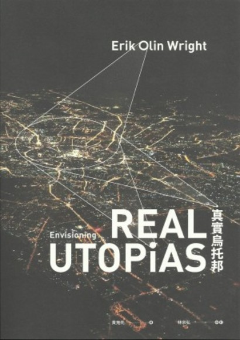
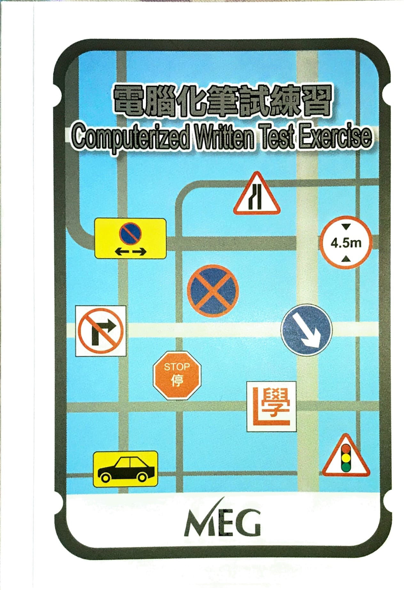

###  Ebook Backup

<table>
<thead>
<tr>
<th>封面</th>
<th>ISBN</th>
<th>書名</th>
<th>作者</th>
<th>出版年份</th>
<th>下載</th>
</tr>
</thead>
<tbody>
<tr>
	<td align="center" nowrap="nowrap"></td>
	<td align="center" nowrap="nowrap"> // </td>
	<td align="center" nowrap="nowrap">道路使用者守則</td>
	<td align="center" nowrap="nowrap"> // </td>
	<td align="center" nowrap="nowrap">2000</td>
	<td align="center" nowrap="nowrap"><a href="https://github.com/LYHPandaKing/EbookBackup/releases/download/Ebook/ruc_2000_chi.pdf">下載</a></td>
</tr>
<tr>
	<td align="center" nowrap="nowrap"></td>
	<td align="center" nowrap="nowrap"> // </td>
	<td align="center" nowrap="nowrap">Road Users' Code</td>
	<td align="center" nowrap="nowrap"> // </td>
	<td align="center" nowrap="nowrap">2000</td>
	<td align="center" nowrap="nowrap"><a href="https://github.com/LYHPandaKing/EbookBackup/releases/download/Ebook/ruc_2000_eng.pdf">下載</a></td>
</tr>
<tr>
	<td align="center" nowrap="nowrap"></td>
	<td align="center" nowrap="nowrap"> // </td>
	<td align="center" nowrap="nowrap">道路使用者守則</td>
	<td align="center" nowrap="nowrap"> // </td>
	<td align="center" nowrap="nowrap">2020</td>
	<td align="center" nowrap="nowrap"><a href="https://github.com/LYHPandaKing/EbookBackup/releases/download/Ebook/road_users_code_2020_chi.pdf">下載</a></td>
</tr>
<tr>
	<td align="center" nowrap="nowrap"></td>
	<td align="center" nowrap="nowrap"> // </td>
	<td align="center" nowrap="nowrap">Road Users' Code</td>
	<td align="center" nowrap="nowrap"> // </td>
	<td align="center" nowrap="nowrap">2020</td>
	<td align="center" nowrap="nowrap"><a href="https://github.com/LYHPandaKing/EbookBackup/releases/download/Ebook/road_users_code_2020_eng.pdf">下載</a></td>
</tr>
<tr>
	<td align="center" nowrap="nowrap"></td>
	<td align="center" nowrap="nowrap">9789881550415</td>
	<td align="center" nowrap="nowrap">香港城邦論</td>
	<td align="center" nowrap="nowrap">陳雲</td>
	<td align="center" nowrap="nowrap">2012 第二版</td>
	<td align="center" nowrap="nowrap"><a href="https://github.com/LYHPandaKing/EbookBackup/releases/download/Ebook/9789881550415.pdf">下載</a></td>
</tr>
<tr>
	<td align="center" nowrap="nowrap"></td>
	<td align="center" nowrap="nowrap">9789881681041</td>
	<td align="center" nowrap="nowrap">香港城邦論II——光復本土</td>
	<td align="center" nowrap="nowrap">陳雲</td>
	<td align="center" nowrap="nowrap">2014 第二版</td>
	<td align="center" nowrap="nowrap"><a href="https://github.com/LYHPandaKing/EbookBackup/releases/download/Ebook/9789881681041.pdf">下載</a></td>
</tr>
<tr>
	<td align="center" nowrap="nowrap"></td>
	<td align="center" nowrap="nowrap">9881777674</td>
	<td align="center" nowrap="nowrap">中文解毒──從混帳文字到通順中文</td>
	<td align="center" nowrap="nowrap">陳雲</td>
	<td align="center" nowrap="nowrap">2008</td>
	<td align="center" nowrap="nowrap"><a href="https://github.com/LYHPandaKing/EbookBackup/releases/download/Ebook/9881777674.pdf">下載</a></td>
</tr>
<tr>
	<td align="center" nowrap="nowrap"></td>
	<td align="center" nowrap="nowrap">9789866525896</td>
	<td align="center" nowrap="nowrap">真實烏托邦</td>
	<td align="center" nowrap="nowrap">Erik Olin Wright 譯者：黃克先</td>
	<td align="center" nowrap="nowrap">2015</td>
	<td align="center" nowrap="nowrap"><a href="https://github.com/LYHPandaKing/EbookBackup/releases/download/Ebook/9789866525896.pdf">下載</a></td>
</tr>
<tr>
	<td align="center" nowrap="nowrap"></td>
	<td align="center" nowrap="nowrap">9789888263202</td>
	<td align="center" nowrap="nowrap">香港簡史——從殖民地至特別行政區</td>
	<td align="center" nowrap="nowrap">John M. Carroll 譯者：林立偉</td>
	<td align="center" nowrap="nowrap">2013 再版</td>
	<td align="center" nowrap="nowrap"><a href="https://github.com/LYHPandaKing/EbookBackup/releases/download/Ebook/9789888263202.pdf">下載</a></td>
</tr>
<tr>
	<td align="center" nowrap="nowrap"></td>
	<td align="center" nowrap="nowrap"> // </td>
	<td align="center" nowrap="nowrap">阿Q正傳</td>
	<td align="center" nowrap="nowrap">魯迅</td>
	<td align="center" nowrap="nowrap"> // </td>
	<td align="center" nowrap="nowrap"><a href="https://github.com/LYHPandaKing/EbookBackup/releases/download/Ebook/THE_TRUE_STORY_OF_Ah_Q.pdf">下載</a></td>
</tr>
<tr>
	<td align="center" nowrap="nowrap"></td>
	<td align="center" nowrap="nowrap"> // </td>
	<td align="center" nowrap="nowrap">王澤漫畫作品全集1-20 老夫子</td>
	<td align="center" nowrap="nowrap">王澤</td>
	<td align="center" nowrap="nowrap"> // </td>
	<td align="center" nowrap="nowrap"><a href="https://github.com/LYHPandaKing/EbookBackup/releases/download/Ebook/OldMasterQ.pdf">下載</a></td>
</tr>
<tr>
	<td align="center" nowrap="nowrap"></td>
	<td align="center" nowrap="nowrap">9789862765012</td>
	<td align="center" nowrap="nowrap">HTML & CSS 網站設計建置優化之道</td>
	<td align="center" nowrap="nowrap">Jon Duckett 譯者：張雅芳</td>
	<td align="center" nowrap="nowrap">2012</td>
	<td align="center" nowrap="nowrap"><a href="https://github.com/LYHPandaKing/EbookBackup/releases/download/Ebook/HTML.and.CSS.Design.and.Build.Websites.pdf">下載</a></td>
</tr>
<tr>
	<td align="center" nowrap="nowrap"></td>
	<td align="center" nowrap="nowrap">9789888028696</td>
	<td align="center" nowrap="nowrap">地下陣線：中共在香港的歴史【節選】</td>
	<td align="center" nowrap="nowrap">陸恭蕙</td>
	<td align="center" nowrap="nowrap">2011</td>
	<td align="center" nowrap="nowrap"><a href="https://github.com/LYHPandaKing/EbookBackup/releases/download/Ebook/9789888028696_Part.pdf">下載</a></td>
</tr>
<tr>
	<td align="center" nowrap="nowrap"></td>
	<td align="center" nowrap="nowrap">//</td>
	<td align="center" nowrap="nowrap">MEG電腦化筆試練習</td>
	<td align="center" nowrap="nowrap">//</td>
	<td align="center" nowrap="nowrap">2020</td>
	<td align="center" nowrap="nowrap"><a href="https://github.com/LYHPandaKing/EbookBackup/releases/download/Ebook/MEG_Computerized_Written_Test_Exercise.pdf">下載</a></td>
</tr>
</tbody>
</table>
